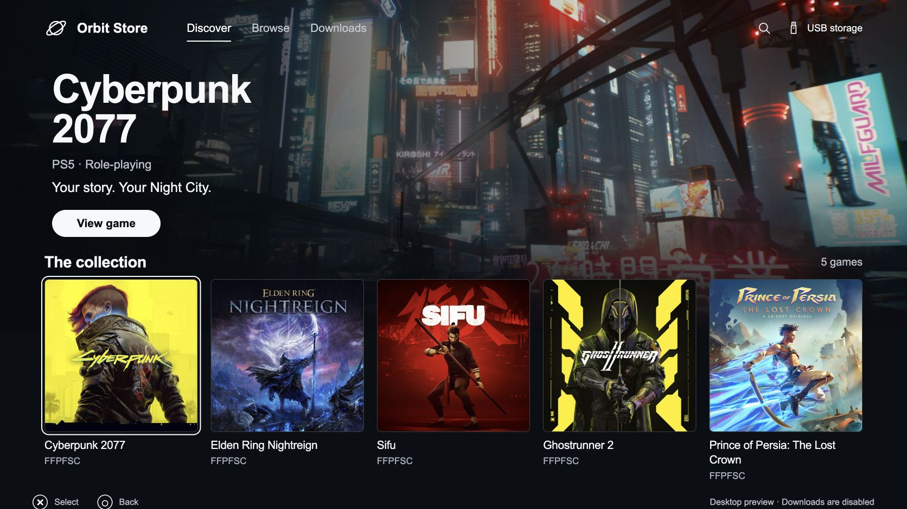

# Orbit Store (Beta)

### A modern, no-BS download manager for PS5.

Orbit brings a cinematic, controller-friendly storefront to PS5 homebrew. Browse on the TV, or manage the same console from your phone. Downloads travel directly from third-party hosts to your PS5 and the drive attached to it.

[Download the latest release](https://github.com/saawant12/orbit-store-ps5/releases/latest) · [Payload Manager feed](https://raw.githubusercontent.com/saawant12/orbit-store-ps5/main/payloads.json) · [llms.txt](https://raw.githubusercontent.com/saawant12/orbit-store-ps5/main/llms.txt)



## Built around the console

- **Direct to PS5.** Files travel directly from the download provider to your console's selected storage.
- **A focused collection.** One card per game. Open it to choose from its available sources and formats, with download size and version shown for each option.
- **Sources you select.** Choose Archive.org, Vikingfile, or both, and acknowledge the download-rights and risk notice before continuing.
- **Storage you choose.** Prefer an attached external drive's `homebrew` folder, or select internal storage.
- **A queue that remembers.** Pause, resume, retry, and recover interrupted work.
- **One interface, everywhere.** Controller on the TV; touch or keyboard on your local network.
- **No account. No telemetry.** Pair your local device with the code shown on your console.

## Beta status

**Orbit Store 0.2.0-beta.1 is an experimental beta.** [Download the beta](https://github.com/saawant12/orbit-store-ps5/releases/tag/v0.2.0-beta.1).

Startup, Media-tab icon registration and opening Orbit from that icon were confirmed on a test PS5 on 3 October 2026. Local tests cover downloads, pause/resume and recovery. Full console transfers, reboot/auto-start and broader firmware compatibility remain unverified in this beta.

The beta contains 20 games, including the original five and 15 newer additions. Each included source passes an exact filename/size check, a download-header check and a bounded range request. These are link-availability checks; full console downloads have not been verified.

A shared metadata snapshot supplies game details and external artwork URLs. Cover images load as you browse; large background art loads for the focused game. Artwork is fetched from publishers’ servers and is not uploaded to these repositories or bundled in Orbit.

## Using the beta

Download [orbit_store.elf](https://github.com/saawant12/orbit-store-ps5/releases/download/v0.2.0-beta.1/orbit_store.elf) and [its SHA-256 checksum](https://github.com/saawant12/orbit-store-ps5/releases/download/v0.2.0-beta.1/orbit_store.elf.sha256). With both files in the same folder, run `shasum -a 256 -c orbit_store.elf.sha256` to verify it. The [release page](https://github.com/saawant12/orbit-store-ps5/releases/tag/v0.2.0-beta.1) also includes the exact source, dependency sources, and licences.

To download Orbit through **Payload Manager**, open **Settings → Manage Sources → Add Source** and paste:

```text
https://raw.githubusercontent.com/saawant12/orbit-store-ps5/main/payloads.json
```

Open the **Orbit Store** source, download **Orbit Store (Beta)**, then run `orbit_store.elf`. The feed includes its version and SHA-256 checksum using the [Payload Manager repository format](https://github.com/itsPLK/ps5-payload-manager/blob/main/CUSTOM_REPOSITORIES.md).

The setup and everyday workflow is:

1. **Run it once.** Run `orbit_store.elf` through your payload manager or ELF loader. Orbit starts, saves itself on the console, and adds the **Orbit Store** home-screen icon.
2. **Turn on auto-start.** In Orbit, open **Auto-start** and turn it on for your payload manager: Payload Manager, or an existing `autoload.txt` autoloader. Homebrew Launcher lists Orbit in its menu; etaHEN users add the saved copy in the Toolbox.
3. **Open the icon.** Once Orbit is running, select its home-screen icon to open the storefront.
4. **Choose your sources.** Sources start off. Select Archive.org, Vikingfile, or both, read the notice, and acknowledge your responsibility to download only content you are legally entitled to access and use.
5. **Download on the console.** Open a game, select its source and format under **Download options**, choose storage, and select **Download to PS5**.
6. **Use your phone if you want.** While Orbit is running, visit `http://<ps5-ip>:34177/` on the same network and select **Pair devices**. Enter the console's six-digit code. Choose **Show code on PS5** if you missed the notification, or open **Pair devices** on the console to keep the code visible until you close it.

After a reboot, run your jailbreak as usual and your payload manager starts Orbit. The icon opens the running storefront; it cannot start Orbit by itself. Orbit never creates an `autoload.txt`, because a new one would stop your autoloader from opening Payload Manager. The reboot and auto-start workflow is awaiting full console validation.

Keep the PS5 awake while downloading. Closing the storefront leaves downloads running. After an Orbit restart, interrupted transfers become paused so you can review and resume them.

## Controls and formats

| Control | Action |
|---|---|
| D-pad / arrow keys | Move focus |
| Cross / Enter | Select |
| Circle / Escape | Back or close details |
| Touch / mouse | Select visible controls |

The initial catalogue uses direct **FFPFSC** files from Archive.org. The downloader also accepts curated direct **exFAT** variants when supplied. Vikingfile can be selected in Sources, but currently shows no compatible releases; downloads from it depend on automatic direct-link resolution working on the console.

Source choices are saved on the console and shared by paired devices. Turning off a source hides its download options and pauses unfinished downloads without deleting files. A game stays visible if another enabled source offers it. Re-enable a source and resume its downloads when ready. There is no user library import or custom source entry in this version.

V1 does **not** extract RAR/7z archives, install or launch games, or download in rest mode. “Complete” means the file was saved and passed available validation. Size-only checks are labelled separately from checksum verification.

## When something needs attention

- **No storage:** attach a writable drive to the PS5 and refresh storage. A drive connected to your computer is not PS5 storage.
- **Drive disconnected:** reconnect the original destination. Orbit will not silently switch to internal storage.
- **Not enough space:** free space on the selected destination before retrying.
- **Source changed:** preserve the partial file until you decide to remove it and restart. Orbit will not append a different file to it.
- **Provider throttling:** let the retry delay finish. Orbit respects the provider's `Retry-After` response.
- **Icon does not open Orbit:** start Orbit through Payload Manager, then open the icon again.
- **Cannot connect:** check that the payload is running and your device is on the same local network. Orbit uses TCP port **34177**.
- **Missed the pairing code:** select **Pair devices**. The PS5 keeps the code on screen; phones and computers can request the notification again every 30 seconds.
- **Port already in use:** Orbit reports the port in its startup error. Check which service is using it before retrying.

## Roadmap

Full console download/resume and reboot/auto-start validation, broader firmware testing, and more verified direct-file sources. Archive extraction, game installation, and additional providers are future work, not advertised as finished features.

## Licence

Orbit Store is free software under the GNU General Public License, version 3 or later. Every release includes the complete source of that build, the sources of its copyleft components, and third-party notices.

---

## IMPORTANT: THIRD-PARTY CONTENT & DOWNLOAD DISCLAIMER

**Orbit Store is an independent download-management application. This project does not host, upload, mirror, or bundle the game files referenced by its catalogue.** File transfers happen directly between third-party providers and the user's selected device. This repository hosts Orbit's documentation and, when released, Orbit's own application files.

Catalogue entries reference publicly accessible third-party URLs. **Publicly accessible does not mean authorised, licensed, or free to redistribute.** Use Orbit only for material you have permission to obtain and use, in accordance with applicable law, relevant licences, and the provider's terms. Owning a game does not, by itself, establish permission to obtain any copy found online.

**Third-party files are outside this project's control.** Their hosts and uploaders control availability and contents. Orbit does not guarantee ownership, authenticity, completeness, safety, compatibility, or continued availability. Download completion, a matching file size, or a matching checksum is a technical result, not a licence or a guarantee that the file is safe to run.

All game names, artwork, trademarks, and other third-party materials belong to their respective owners. Orbit is **not affiliated with or endorsed by** Sony Interactive Entertainment, PlayStation, game publishers, or download providers. The app does not supply accounts, credentials, purchase entitlements, or permission to bypass access restrictions.

To report an incorrect entry or a rights concern, open an issue with the affected title, URL, and sufficient information to identify the concern. Do not post private personal information. The underlying hosting provider is responsible for files it hosts; Orbit's maintainers can review catalogue references controlled by this project.
