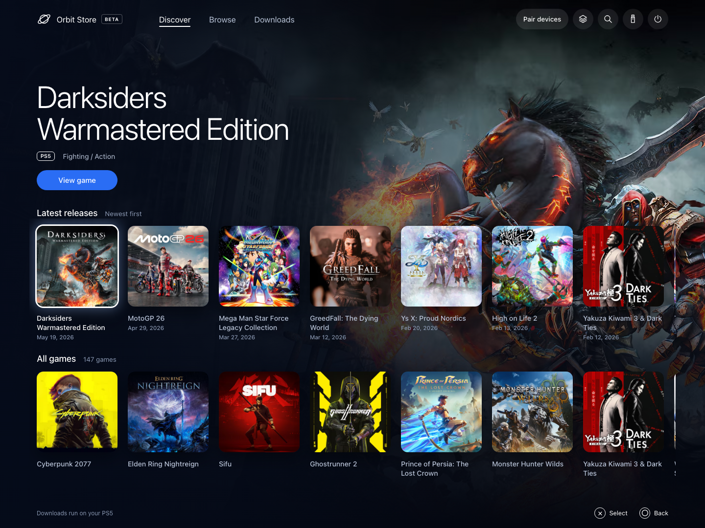
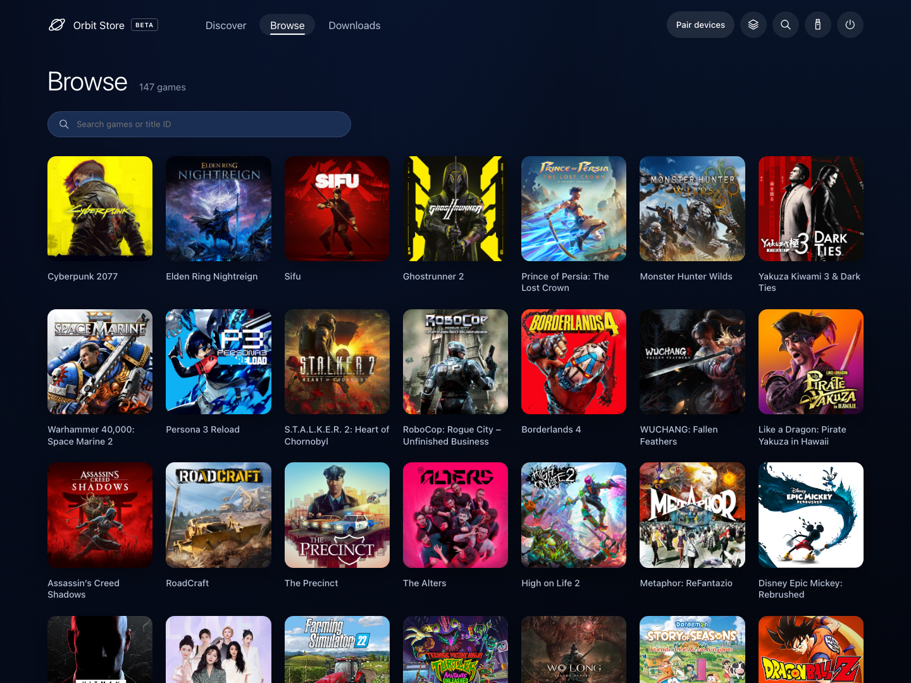
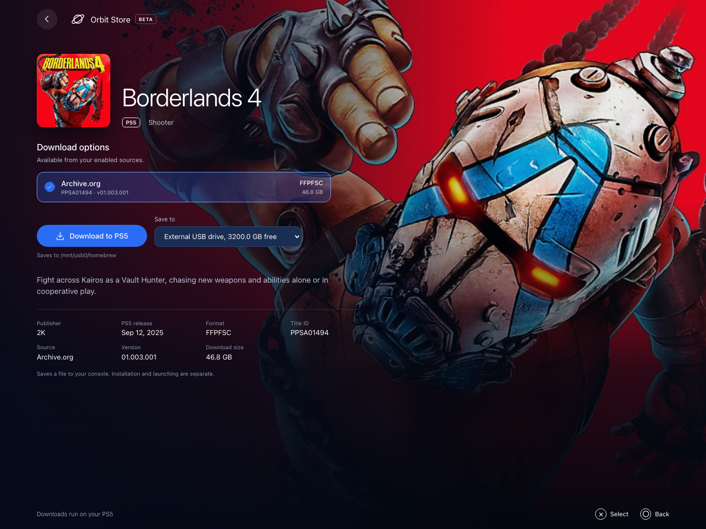
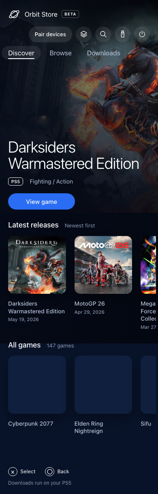
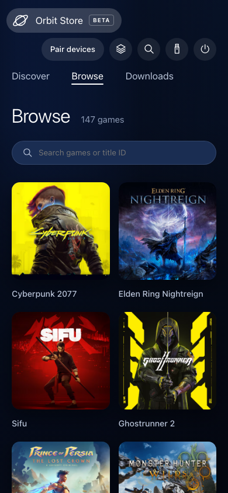
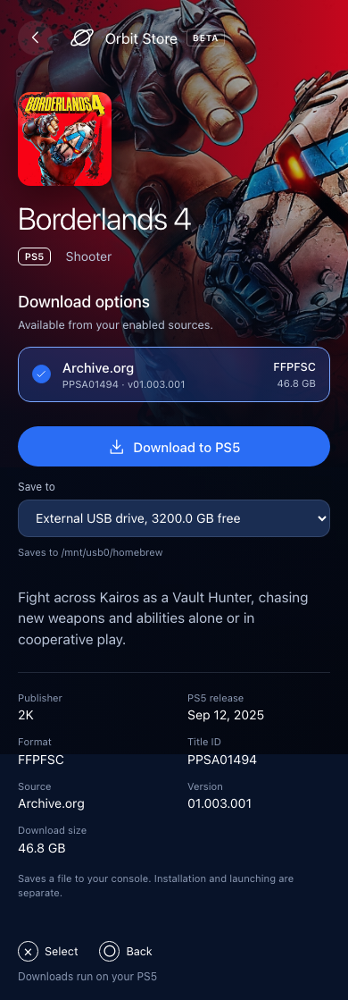

# Orbit Store (Beta)

### A modern, no-BS download manager for PS5.

Orbit brings a cinematic, controller-friendly storefront to PS5 homebrew. Browse on the TV, or manage the same console from your phone. Downloads travel directly from third-party hosts to your PS5 and the drive attached to it.

[Download the latest release](https://github.com/saawant12/orbit-store-ps5/releases/latest) · [Payload Manager feed](https://raw.githubusercontent.com/saawant12/orbit-store-ps5/main/payloads.json) · [llms.txt](https://raw.githubusercontent.com/saawant12/orbit-store-ps5/main/llms.txt)

## Desktop

Find your next download in **Latest releases**, or search the full catalogue. Open a game to check its size, version and available download options before you choose.

Screenshots show a paired preview with example USB storage.





## Phone

Check progress, pause a download or queue another game from your phone. Pair it with your PS5 on the same network to control the same queue from either screen.

<table>
  <tr>
    <th align="center">Discover</th>
    <th align="center">Browse</th>
    <th align="center">Download</th>
  </tr>
  <tr>
    <td valign="top" width="33%"></td>
    <td valign="top" width="33%"></td>
    <td valign="top" width="33%"></td>
  </tr>
</table>

## Built around the console

- **Direct to PS5.** Files travel directly from the download provider to your console's selected storage.
- **One file per game.** Start with 147 games to browse, each available as a single download. No archive parts to collect.
- **A focused collection.** One card per game. Open it to choose from its available sources and formats, with download size and version shown for each option.
- **Sources you select.** Choose Archive.org, Vikingfile, or both, and acknowledge the download-rights and risk notice before continuing.
- **Storage you choose.** Prefer an attached external drive's `homebrew` folder, or select internal storage.
- **New games without reinstalling.** Catalogue additions arrive automatically. Check for more in App settings, or keep browsing your last catalogue while offline.
- **Your games in Library.** See installed games and drive sources, then manage compatible sources through ShadowMount.
- **Manager setup by choice.** Choose where Orbit adds its payload. Automatic startup is separate.
- **Updates in Orbit.** Check for a release, reinstall when needed, and see which version is running or saved for next start.
- **A queue you control.** Switch between active, finished, failed and cancelled downloads, move waiting items up or down, and clear history while keeping downloaded files.
- **Know what fits.** See free space now, what unfinished downloads still need, and how much will remain afterward.
- **Find it your way.** Filter by source, format or download size. Sort by title, release date, addition date or size, and save favourites shared with your paired devices.
- **One interface, everywhere.** Controller on the TV; touch or keyboard on your local network.
- **No account. No telemetry.** Pair your local device with the code shown on your console.

## Beta status

**Orbit Store 0.4.1 is an experimental beta.** [Download the beta](https://github.com/saawant12/orbit-store-ps5/releases/tag/v0.4.1).

Version 0.4.1 adds **Library**, so you can see installed games and sources on your drives in one place. With a compatible ShadowMount local API, scan, mount or unmount supported sources, copy or move them between drives, and check your storage. Catalogue and download pages connect to Library so you can see what you already have.

**Payload-manager setup is now opt-in.** Choose **App settings → Payload managers → Add Orbit** to let Orbit add and update a copy. Existing copies stay in place until you choose whether to allow updates. Auto-start is a separate choice, and Orbit leaves your manager's global Autoload switch unchanged.

Local automated tests and desktop/phone checks cover these features. Library requires ShadowMount's compatible v1 local API; actions depend on the capabilities it exposes. Console acceptance for Library operations, full downloads, online catalogue refresh, reboot/auto-start and broader firmware support remains pending. The reported etaHEN toggle interaction is still under investigation.

The current downloads are single-file **FFPFSC** files from **Archive.org**. Links were checked for availability; their contents have not been fully downloaded and tested on console.

New games and updated links arrive through catalogue updates. You only need an Orbit app update for new features and fixes. Your queued downloads keep the files you originally chose.

## Using the beta

Download [orbit_store.elf](https://github.com/saawant12/orbit-store-ps5/releases/download/v0.4.1/orbit_store.elf) and [its SHA-256 checksum](https://github.com/saawant12/orbit-store-ps5/releases/download/v0.4.1/orbit_store.elf.sha256). With both files in the same folder, run `shasum -a 256 -c orbit_store.elf.sha256` to verify it. The [release page](https://github.com/saawant12/orbit-store-ps5/releases/tag/v0.4.1) also includes the exact source, dependency sources, and licences.

To download Orbit through **Payload Manager**, open **Settings → Manage Sources → Add Source** and paste:

```text
https://raw.githubusercontent.com/saawant12/orbit-store-ps5/main/payloads.json
```

Open the **Orbit Store** source, download **Orbit Store (Beta)**, then run `orbit_store.elf`. The feed includes its version and SHA-256 checksum using the [Payload Manager repository format](https://github.com/itsPLK/ps5-payload-manager/blob/main/CUSTOM_REPOSITORIES.md).

The setup and everyday workflow is:

1. **Run it once.** Run `orbit_store.elf` through your payload manager or ELF loader. Orbit starts, saves itself on the console, and adds the **Orbit Store** home-screen icon.
2. **Choose manager setup.** Optionally open **App settings → Payload managers → Add Orbit** for Payload Manager or Homebrew Launcher. This adds a copy and lets Orbit keep it current. Auto-start is separate: use **Start automatically**, then enable the global Autoload switch yourself in Payload Manager if needed. Existing `autoload.txt` lists are supported; etaHEN setup is manual in its Toolbox.
3. **Open the icon.** Once Orbit is running, select its home-screen icon to open the storefront.
4. **Choose your sources.** Sources start off. Select Archive.org, Vikingfile, or both, read the notice, and acknowledge your responsibility to download only content you are legally entitled to access and use.
5. **Download on the console.** Open a game, select its source and format under **Download options**, choose storage, and select **Download to PS5**.
6. **Use your phone if you want.** While Orbit is running, visit `http://<ps5-ip>:34177/` on the same network and select **Pair devices**. Enter the console's six-digit code. Choose **Show code on PS5** if you missed the notification, or open **Pair devices** on the console to keep the code visible until you close it.

After a reboot, run your jailbreak as usual, then start Orbit manually or through auto-start you have configured. The icon opens the running storefront; it cannot start Orbit by itself. Orbit never creates an `autoload.txt`, because a new one would stop your autoloader from opening Payload Manager. The reboot and auto-start workflow is awaiting full console validation.

Keep the PS5 awake while downloading. Closing the storefront leaves downloads running. After an Orbit restart, interrupted transfers become paused so you can review and resume them.

## Updating or reinstalling Orbit

**Coming from beta.2 or earlier:** download the new ELF and replace the existing `orbit_store.elf` in Payload Manager. Accept its overwrite/reinstall prompt. Pause downloads, stop only the identifiable Orbit process in Payload Manager’s **Active Processes**, then run the new ELF. If you cannot confidently identify the process, restart the console when convenient, run the jailbreak and launch the new ELF. Keep the Orbit icon and its saved data.

To restore a deleted Orbit icon, start Orbit through your payload manager. Your paired devices, source choices and download queue stay saved.

Loading an ELF while Orbit is already running saves the replacement for the next start. It does not switch the active session. The notification now explains this; an existing icon is expected and does not need to be removed.

**From beta.3 onward:**

1. Open **App settings → Update / reinstall → Check for updates**.
2. Choose **Install update**, or **Reinstall release** for the current published version. Orbit downloads the official ELF and verifies its SHA-256 checksum before replacing the saved copy.
3. When **Restart needed** appears, select **Stop Orbit to restart** and confirm. Your queue is saved and paused; other payloads keep running.
4. Run `/data/orbit-store/orbit_store.elf`, or a manager copy you opted to keep in sync, and reopen Orbit. Review and resume your downloads.

**Stop syncing** preserves the existing manager copy and its auto-start settings, but stops updating that copy. If you prefer to keep a manually imported ELF outside sync, replace it yourself when updating or launch the saved path above. Running an old imported ELF starts that older version.

The panel shows **Running**, **Saved for next start**, and **Latest release** separately. Pairing, source choices and the download queue are preserved. Updates are manual; no release is installed just by opening the panel. If a download or copy fails, Orbit reports the error and leaves the running session open for a retry.

## Managing your downloads

Open **Downloads** and choose **Active**, **Finished**, **Failed** or **Cancelled**. Finished contains only successfully completed downloads; cancelled items have their own view. Move waiting downloads up or down to choose what runs next. Paused items keep their place. A retry countdown tells you when Orbit will try an interrupted download again.

**Remove from history**, **Clear finished history** and **Clear cancelled history** keep downloaded files on your drive. Each clear button affects only its own view. A cancelled download with a kept partial file stays listed so you can resume it. To remove it, reconnect its original drive, choose **Partial file options → Delete partial file**, then remove the history entry.

Before queuing a game, check **Free now**, **Unfinished downloads** and **After queue + this download**. Paused and failed downloads count toward the estimate; cancelled ones do not. Other apps can change free space, so Orbit checks again when a download starts.

## Your Library

Open **Library** to see installed games and game files reported on your drives, including their mount and availability status. Search by name, title ID or path and filter by status, location or format. Library works independently of your download-source choices.

Run a compatible **ShadowMount with its v1 local HTTP API enabled** on the same PS5. Orbit reads that local inventory and shows the actions your ShadowMount version supports. It does not start ShadowMount or change its configuration.

- **Refresh** updates the view. **Scan for games** asks ShadowMount to discover sources and may register or mount them after confirmation.
- Open a game to **mount or unmount** its compatible source. Orbit does not launch games or uninstall them.
- **Copy** keeps the original; **Move** asks ShadowMount to remove it after a successful transfer. Unmount the source first, select the destination and confirm. Pause active and queued Orbit downloads before starting.
- Open **Storage** to check drive capacity and request game sizes. Follow copy/move progress and cancel while ShadowMount reports it is safe. A storage job can continue if Orbit stops.

If ShadowMount is absent or its API is incompatible, Library explains what is missing. A disconnected source stays distinguishable from an available one; refreshing does not delete files.

## Finding and saving games

In **Browse**, combine source, format and download-size filters, then choose a sort order. Size sorting uses the smallest option matching your filters. **Recently added** shows titles added to Orbit within the last 30 days; **Latest releases** follows game release dates.

Open a game's details and choose **Add to favourites**. Your favourites are shared between the console and paired devices and stay saved after restarting Orbit. Disabling a source hides its games without forgetting your favourites.

## Refreshing the game catalogue

New games appear automatically, without reinstalling or restarting Orbit. To check for additions yourself, open **App settings → Game catalogue → Refresh catalogue**. Orbit also checks when it starts and every six hours while running.

If your connection drops, you can still browse the last available catalogue. Reconnect to download games or get the latest additions. Your source choices and queued downloads stay as you left them.

## Controls and formats

| Control | Action |
|---|---|
| D-pad / arrow keys | Move focus |
| Cross / Enter | Select |
| Circle / Escape | Back or close details |
| Touch / mouse | Select visible controls |

The catalogue uses direct **FFPFSC** files from Archive.org. The downloader also accepts curated direct **exFAT** variants when supplied. Vikingfile can be selected in Sources, but currently shows no compatible releases; downloads from it depend on automatic direct-link resolution working on the console.

Source choices are saved on the console and shared by paired devices. Turning off a source hides its download options and pauses unfinished downloads without deleting files. A game stays visible if another enabled source offers it. Re-enable a source and resume its downloads when ready. There is no user library import or custom source entry in this version.

Orbit does **not** extract RAR/7z archives, directly install packages, launch games, or download in rest mode. Library actions use ShadowMount; a confirmed scan may register or mount discovered games. “Complete” means the file was saved and passed available validation. Size-only checks are labelled separately from checksum verification.

## When something needs attention

- **No storage:** attach a writable drive to the PS5 and refresh storage. A drive connected to your computer is not PS5 storage.
- **Drive disconnected:** reconnect the original destination. Orbit will not silently switch to internal storage.
- **Not enough space:** free space on the selected destination before retrying.
- **Source changed:** preserve the partial file until you decide to remove it and restart. Orbit will not append a different file to it.
- **“Provider returned a page” on an older version:** update to the latest release, restart Orbit, then open **Downloads → Failed → Retry download**. Existing partial files are checked before resuming. If the provider actually returns an error page, Orbit will still reject it.
- **Provider throttling:** let the retry delay finish. Orbit respects the provider's `Retry-After` response.
- **Icon does not open Orbit:** start Orbit through Payload Manager, then open the icon again.
- **Cannot connect:** check that the payload is running and your device is on the same local network. Orbit uses TCP port **34177**.
- **Missed the pairing code:** select **Pair devices**. The PS5 keeps the code on screen; phones and computers can request the notification again every 30 seconds.
- **Port already in use:** Orbit reports the port in its startup error. Check which service is using it before retrying.

## Roadmap

Full console download/resume and reboot/auto-start validation, broader firmware testing, and more verified direct-file sources. Archive extraction, game installation, and additional providers are future work, not advertised as finished features.

## Licence

Orbit Store is free software under the GNU General Public License, version 3 or later. Every release includes the complete source of that build, the sources of its copyleft components, and third-party notices.

---

## IMPORTANT: THIRD-PARTY CONTENT & DOWNLOAD DISCLAIMER

**Orbit Store is an independent download-management application. This project does not host, upload, mirror, or bundle the game files referenced by its catalogue.** File transfers happen directly between third-party providers and the user's selected device. This repository hosts Orbit's documentation and, when released, Orbit's own application files.

Catalogue entries reference publicly accessible third-party URLs. **Publicly accessible does not mean authorised, licensed, or free to redistribute.** Use Orbit only for material you have permission to obtain and use, in accordance with applicable law, relevant licences, and the provider's terms. Owning a game does not, by itself, establish permission to obtain any copy found online.

**Third-party files are outside this project's control.** Their hosts and uploaders control availability and contents. Orbit does not guarantee ownership, authenticity, completeness, safety, compatibility, or continued availability. Download completion, a matching file size, or a matching checksum is a technical result, not a licence or a guarantee that the file is safe to run.

All game names, artwork, trademarks, and other third-party materials belong to their respective owners. Orbit is **not affiliated with or endorsed by** Sony Interactive Entertainment, PlayStation, game publishers, or download providers. The app does not supply accounts, credentials, purchase entitlements, or permission to bypass access restrictions.

To report an incorrect entry or a rights concern, open an issue with the affected title, URL, and sufficient information to identify the concern. Do not post private personal information. The underlying hosting provider is responsible for files it hosts; Orbit's maintainers can review catalogue references controlled by this project.
