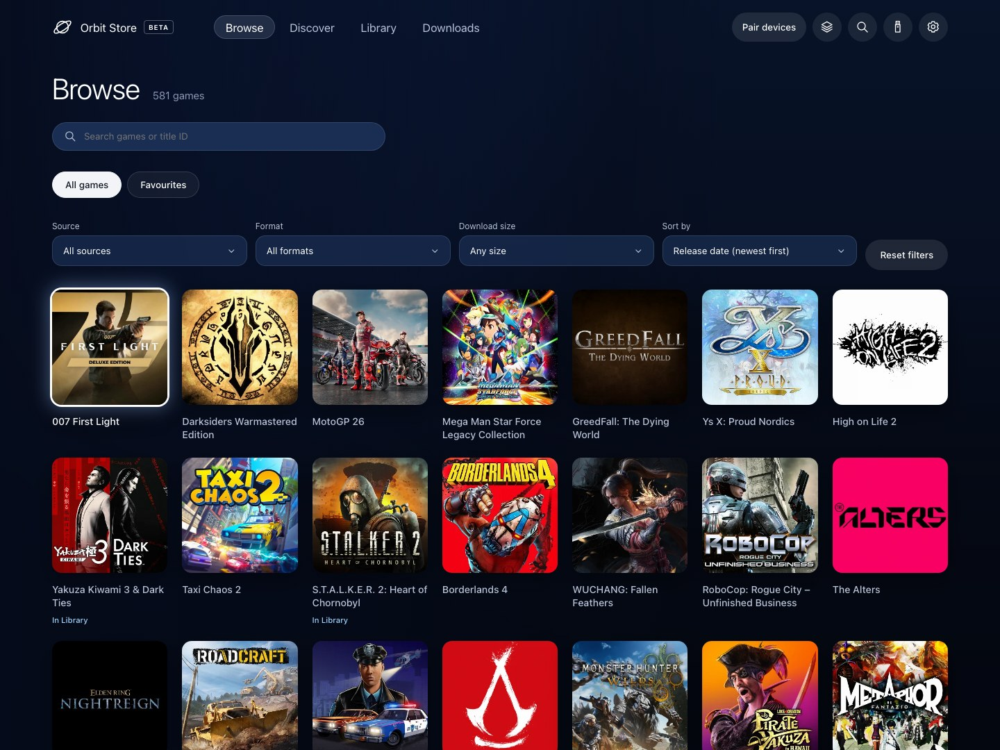
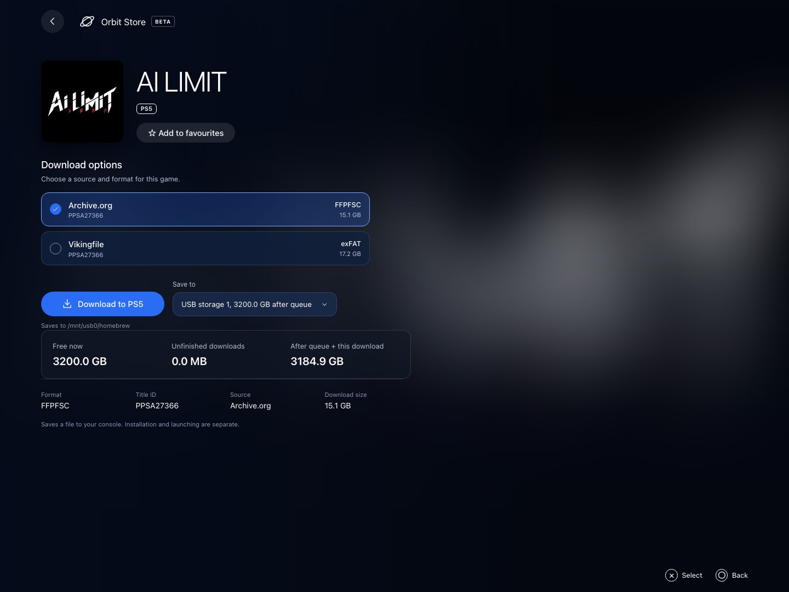
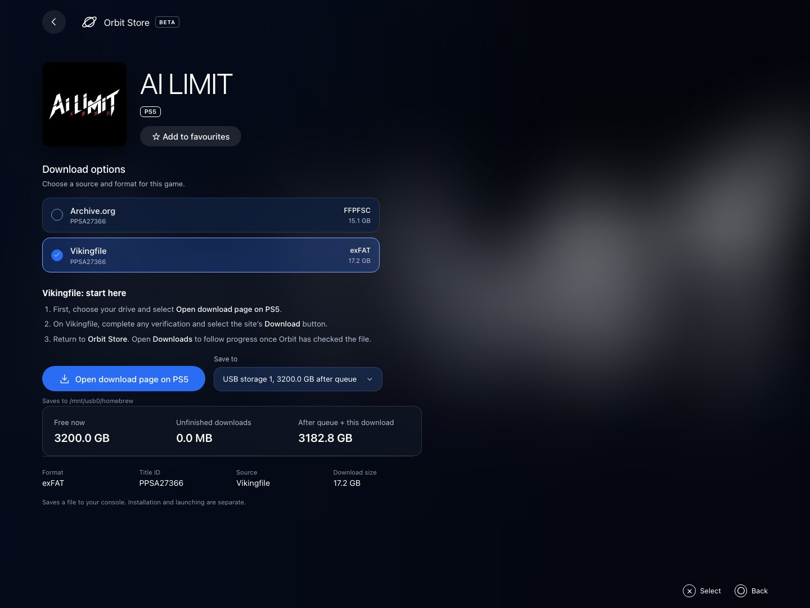
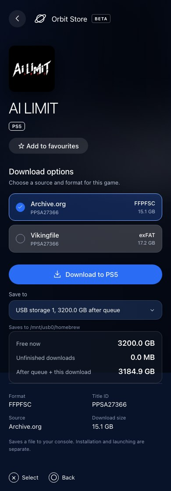
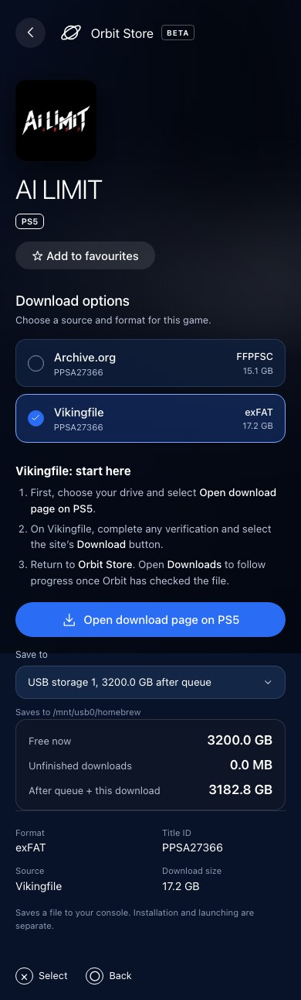

# Find and download a game

Orbit includes 581 games with single-file options from Archive.org and Vikingfile. Each game appears once; open it to choose from its available sources and formats. The selection depends on which sources you enable.

## Browse and choose

Browse opens first and defaults to **Release date (newest first)**. Games without a recorded date follow alphabetically. Search by game name or title ID, filter by source, format or download size, and change the sort order. **Reset filters** restores the default. Missing dates and other metadata can be added later through catalogue updates.

*Use filters to find options that fit your drive and preferred format. Sizes reflect the download option you choose.*

**Discover** offers Latest releases and All games. Save a game from its details page to find it under **Favourites** later; favourites are shared with your paired devices.

| Input | Action |
|---|---|
| D-pad or arrow keys | Move focus |
| Cross or Enter | Select the focused control |
| Circle or Escape | Go back or close a panel |
| Search: Down or Enter | Move into results |
| Search: Up | Return to the Browse tab |
| Search: Left or Right | Edit the text normally |
| Touch or mouse | Select a control |

## Pick a source, format and drive

On the game page, compare the options under **Download options**. Select the source and format you want, then use **Save to** to choose storage attached to the PS5. Check **Free now**, **Unfinished downloads**, and **After queue + this download** before starting.

*Different sources can offer different formats or sizes for the same game. Select the exact option you intend to download.*

For a direct option, select **Download to PS5**. Orbit adds it to Downloads after its preflight checks.

## Vikingfile: open the page on PS5 first

**Requires Orbit 0.5.0 or later.** Older versions keep their Archive.org catalogue and do not receive unsupported Vikingfile options.

1. Select the Vikingfile option and destination drive in Orbit.
2. Select **Open download page on PS5**. This is the first step; it opens the provider page on the console.
3. Complete any verification yourself and select the provider’s **Download** button. Follow the file’s download controls if a redirect opens another Vikingfile page.
4. Return to Orbit Store and open **Downloads**. Orbit checks that the captured file matches the selected option before adding it to your queue.

*The blue Open download page on PS5 button starts the provider step. Download on Vikingfile comes next; then return to Orbit.*

You can start the session from a paired phone, but the provider page and verification still appear on the PS5. There is no need to paste a generated link. If the session expires or reports no matching file, return to Orbit and start that option again. Only one browser verification session can run at a time; **Cancel verification** stops the pending session without adding a download.

Some previously checked Vikingfile options also offer **Download directly**. File-page-only options require the browser steps above.

<table>
  <tr><th>Choose an option on your phone</th><th>Start the PS5 browser step</th></tr>
  <tr>
    <td valign="top" width="50%"></td>
    <td valign="top" width="50%"></td>
  </tr>
</table>

*Screenshots use the release UI with local sample storage and paired-console responses. The actual provider page is operated on the PS5.*

## Follow your queue

Use **Active**, **Finished**, **Failed**, and **Cancelled** to find a transfer. Move waiting items up or down, pause and resume, or cancel. Cancelled items have their own view; Finished contains successfully completed downloads.

Supported large files can use two connections. Speed depends on the provider, network and drive. Pause, Resume and Cancel control the whole file.

**Remove from history** and the history-clear buttons keep completed files. A cancelled item with a kept partial remains recoverable. To remove that partial, reconnect its original drive, select **Partial file options → Delete partial file**, then remove its history entry.

Keep the PS5 awake. Closing the control browser leaves the download worker running; stopping Orbit interrupts it. Interrupted transfers return paused after restart. Orbit does not extract archives, directly install packages, launch games or continue downloading in rest mode. For compatible drive files, see [Library](library.md).

## Get new games and corrected metadata

Orbit checks its catalogue on startup and every six hours. Use **App settings → Game catalogue → Refresh catalogue** for a manual check. The saved catalogue remains available offline, and queued downloads keep their original file identity. Catalogue additions and date corrections do not need an ELF update.

[Getting started](getting-started.md) · [Troubleshooting](troubleshooting.md) · [Project home](../README.md)
