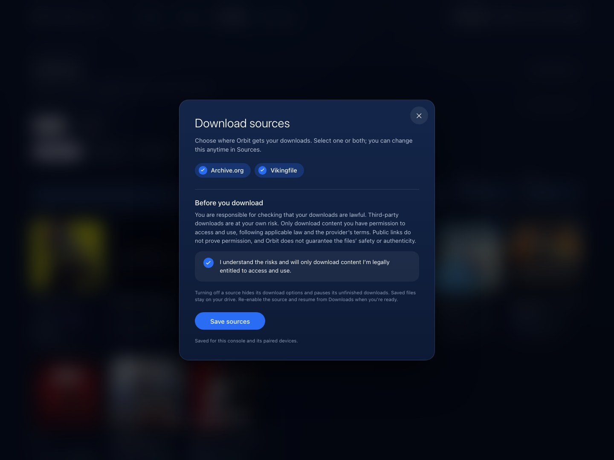
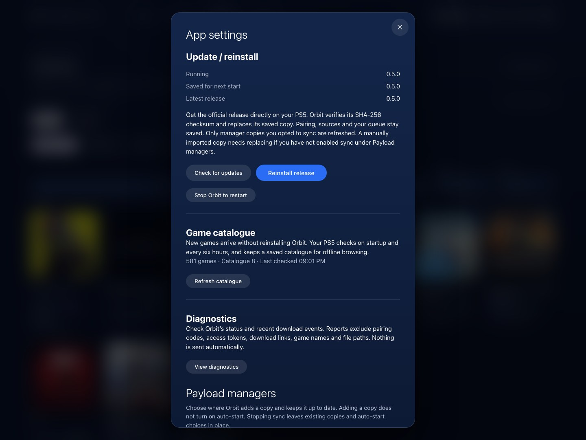

# Get started with Orbit Store

Orbit runs on your PS5. Use the TV with your controller, or pair a phone or computer to manage the same catalogue and download queue. Files go to the PS5’s selected storage.

You need a PS5 environment that can run homebrew ELF payloads, an ELF loader or payload manager, internet access for provider downloads, and enough writable storage. A phone or computer should be on the same local network. Library management additionally needs a compatible ShadowMount v1 local API.

## Install and open Orbit

1. Get `orbit_store.elf` and `orbit_store.elf.sha256` from the [latest release](https://github.com/saawant12/orbit-store-ps5/releases/latest). Verify the checksum with `shasum -a 256 -c orbit_store.elf.sha256` from the folder containing both files.
2. Load the ELF through your payload manager. Orbit saves its runtime and creates its icon in the PS5 Media tab.
3. Open **Orbit Store**. Browse is the starting page.
4. Open **Sources**, choose Archive.org, Vikingfile, or both, and read and acknowledge the download notice. Only download material you have permission to obtain and use.
5. Choose a game, source, format and destination drive. Follow the [download guide](downloads.md) for direct and Vikingfile browser options.

A drive connected to your phone or computer is not a PS5 destination. Attach your external drive to the console; Orbit uses its `homebrew` folder when available.



*Sources are your choice. Turning one off later hides its options and pauses unfinished downloads without deleting files. Screenshots show the release interface with local sample console and storage data.*

## Optional Payload Manager feed

In Payload Manager, open **Settings → Manage Sources → Add Source** and enter:

```text
https://raw.githubusercontent.com/saawant12/orbit-store-ps5/main/payloads.json
```

Open the Orbit Store source, download **Orbit Store (Beta)**, then run `orbit_store.elf`.

## Keep a manager copy up to date

Open **App settings → Payload managers** and choose **Add Orbit**, or **Allow updates to this copy** if it is already listed. This opts that manager into receiving Orbit updates. **Stop syncing** leaves the existing copy and auto-start choices in place.

Auto-start is separate. Choose **Start automatically** if wanted and enable your manager’s global Autoload switch yourself. Orbit does not change that global switch. After a reboot, run your jailbreak and start Orbit manually or through your configured auto-start. The home-screen icon opens Orbit while its payload is running; it cannot start a stopped payload.

## Update or reinstall

1. Open **App settings → Update / reinstall → Check for updates**.
2. Choose **Install update**, or **Reinstall release** for the current version. Orbit verifies the release checksum and saves the replacement.
3. Select **Stop Orbit to restart** and confirm. The queue is saved; other payloads are left running.
4. Run `/data/orbit-store/orbit_store.elf` or a manager copy you opted to keep in sync. Reopen the icon and resume any paused downloads.

**Running**, **Saved for next start**, and **Latest release** are separate. Uploading a new ELF while Orbit is running saves it for the next start; it does not change the active session. A manually imported copy outside sync must be replaced yourself. Keep the icon and saved data.



*App updates install features and fixes. Refresh catalogue updates game data without reinstalling the app.*

Very old beta.2 or earlier installations need a manual ELF replacement and Orbit restart first. Pause downloads and stop only an identifiable Orbit process; if you cannot identify it, restart the console when convenient and load the new ELF after the jailbreak.

## Pair your phone or computer

While Orbit is running, visit `http://<ps5-ip>:34177/` on the same network. Choose **Pair devices** and enter the six-digit code shown on the PS5. On the console, **Pair devices** keeps the code visible; **Show code on PS5** repeats its notification. Do not share the code publicly.

Your paired device controls the console’s queue. For Vikingfile browser verification, use the PS5 screen to complete the provider steps even when you start from your phone.

[Download guide](downloads.md) · [Library guide](library.md) · [Troubleshooting](troubleshooting.md) · [Project home](../README.md)
